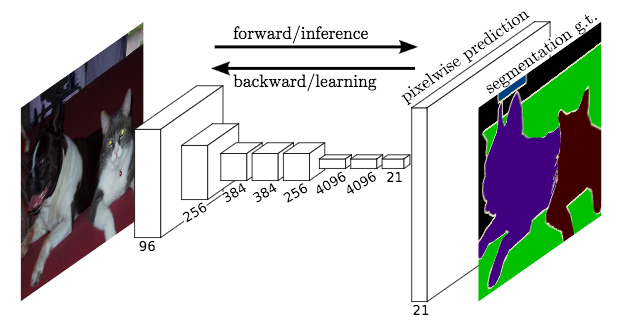

# Semantic Segmentation
## Introduction
This project implements a Fully Convolutional Network (FCN) for scene understanding. It learns to classify road and not road at the per-pixel level. Implemented in Tensorflow.

### Network
A pre-trained VGG-16 network was converted to a fully convolutional network by converting the final fully connected layer to a 1x1 convolution and setting the depth equal to the number of desired classes (in this case, two: road and not-road). Performance is improved through the use of skip connections, performing 1x1 convolutions on previous VGG layers (in this case, layers 3 and 4) and adding them element-wise to upsampled (through transposed convolution) lower-level layers (i.e. the 1x1-convolved layer 7 is upsampled before being added to the 1x1-convolved layer 4). Each convolution and transpose convolution layer includes a kernel initializer and regularizer.

See the architecture below from this paper [Fully Convolutional Networks for Semantic Segmentation](https://people.eecs.berkeley.edu/~jonlong/long_shelhamer_fcn.pdf).



### Optimizer
The loss function for the network is cross-entropy, and an Adam optimizer is used.

### Training
The hyperparameters used for training are:

keep_prob: 0.5
learning_rate: 0.001
epochs: 50
batch_size: 5

Chosen via a process of trial and error. I found having a slightly higher learning rate of 0.001 with more corrective "steps" (combination of high number of epochs and low batch size) worked out well for this project. Something to note is that the loss reaches below 0.050 after about 18-20 epochs. I could have significantly reduced the number of epochs and increased the batch size to get similar results.

### Results
Loss per batch during training

* Epoch 10: 0.150
* Epoch 20: 0.054
* Epoch 30: 0.078
* Epoch 40: 0.033
* Epoch 50: 0.029

### Samples


## Setup
#### Frameworks and Packages
Make sure you have the following is installed:
 - [Python 3](https://www.python.org/)
 - [TensorFlow](https://www.tensorflow.org/)
 - [NumPy](http://www.numpy.org/)
 - [SciPy](https://www.scipy.org/)

#### Dataset
Download the [Kitti Road dataset](http://www.cvlibs.net/datasets/kitti/eval_road.php) from [here](http://www.cvlibs.net/download.php?file=data_road.zip).  Extract the dataset in the `data` folder.  This will create the folder `data_road` with all the training a test images.

#### Run
Run the following command to run the project:
```
conda env create -f environment.yml
source activate myenv
python main.py
```
